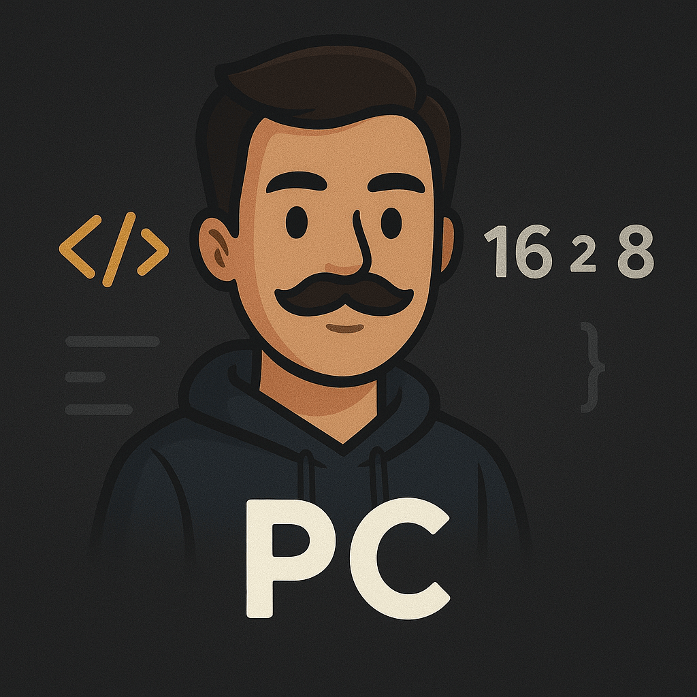

# 🚀 Portfolio Website

A modern, responsive portfolio website built with React, Vite, and Tailwind CSS, showcasing my skills, projects, education, and professional experience.



## ✨ Features

- **🎨 Modern UI/UX** - Clean, professional design with smooth animations and transitions
- **📱 Fully Responsive** - Optimized for all devices and screen sizes
- **⚡ Lightning Fast** - Built with Vite for optimal performance
- **🌙 Custom Styling** - Tailwind CSS with custom color schemes and animations
- **📧 Contact Form** - Integrated with web3forms for direct communication
- **📄 Resume Download** - Easy access to downloadable resume
- **🎭 Smooth Animations** - Enhanced with Framer Motion for fluid user experience

## 🛠️ Tech Stack

- **Frontend Framework:** React 19.2.0
- **Build Tool:** Vite 7.2.4
- **Styling:** Tailwind CSS 4.1.18
- **Animations:** Framer Motion 12.23.26
- **Email Service:** web3forms
- **Code Quality:** ESLint

## 📂 Project Structure

```
Portfolio/
├── public/
│   ├── avatar.png                           # Profile picture
│   ├── PriyanshuChoudharyResumeLatest.pdf  # Resume file
│   └── vite.svg
├── src/
│   ├── components/
│   │   ├── Contact.jsx      # Contact form and social links
│   │   ├── Education.jsx    # Educational background
│   │   ├── Experience.jsx   # Work experience timeline
│   │   ├── Hero.jsx         # Landing section with intro
│   │   ├── Navbar.jsx       # Navigation bar
│   │   ├── Projects.jsx     # Featured projects showcase
│   │   └── Skills.jsx       # Technical skills display
│   ├── App.jsx              # Main application component
│   ├── App.css              # Application styles
│   ├── index.css            # Global styles and custom CSS
│   └── main.jsx             # Application entry point
├── index.html
├── package.json
└── vite.config.js
```

## 🚀 Getting Started

### Prerequisites

- Node.js (version 14 or higher)
- npm or yarn package manager

### Installation

1. **Clone the repository**
   ```bash
   git clone https://github.com/yourusername/portfolio.git
   cd portfolio
   ```

2. **Install dependencies**
   ```bash
   npm install
   ```

3. **Set up environment variables**
   
   Create a `.env` file in the root directory and add your web3forms credentials:
   ```env
   VITE_WEB3FORMS_ACCESS_KEY=your_access_key
   ```

4. **Run the development server**
   ```bash
   npm run dev
   ```

5. **Open your browser**
   
   Navigate to `http://localhost:5173` to view the portfolio

## 📦 Available Scripts

- `npm run dev` - Start the development server
- `npm run build` - Build for production
- `npm run preview` - Preview the production build
- `npm run lint` - Run ESLint for code quality checks

## 🎨 Sections

### 🏠 Hero
Landing section with introduction, role description, and call-to-action buttons

### 💼 Skills
Display of technical skills and expertise areas

### 👨‍💼 Experience
Professional work experience timeline

### 📁 Projects
Showcase of featured projects with descriptions and links

### 🎓 Education
Academic background and qualifications

### 📬 Contact
Contact form powered by EmailJS and social media links

## 🌐 Deployment

### Build for Production

```bash
npm run build
```

The optimized production build will be created in the `dist` folder.

### Deploy to Popular Platforms

#### Vercel
```bash
npm install -g vercel
vercel
```

#### Netlify
```bash
npm install -g netlify-cli
netlify deploy --prod
```

#### GitHub Pages
1. Install gh-pages: `npm install --save-dev gh-pages`
2. Add to package.json scripts:
   ```json
   "deploy": "vite build && gh-pages -d dist"
   ```
3. Run: `npm run deploy`


## 👤 Author

**Priyanshu Choudhary**

- Full-stack MERN Developer
- Email: cpriyanshu211@gmail.com
- Portfolio: [Your Live Portfolio URL]
- LinkedIn: [Your LinkedIn Profile]
- GitHub: [Your GitHub Profile]

## ⭐ Show Your Support

Give a ⭐️ if you like this project!

---

**Made with ❤️ by Priyanshu Choudhary**
